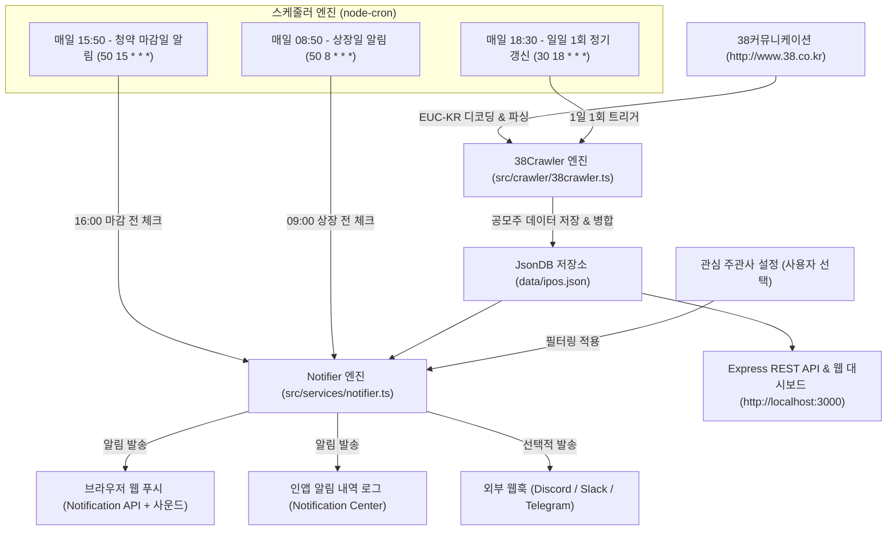

# 📈 한국 주식 공모주 일정 & 실시간 알리미 (Korean IPO Notifier)

> **38커뮤니케이션** 실시간 크롤링 기반 한국 주식 공모주 청약 마감일(16:00 전) 및 상장일(09:00 전) 자동 알림 웹 애플리케이션


---

## 🌟 주요 핵심 기능

1. **38커뮤니케이션 실시간 크롤링 & EUC-KR 디코딩**
   - 종목명, 시장 구분(코스닥/코스피/스팩), 공모청약일정, 상장일, 환불일, 확정/희망 공모가, 청약 경쟁률, 주관사 목록 수집
   - 각 공모주별 **38커뮤니케이션 상세페이지 직링크** 연동
2. **Vercel Serverless & Cron 완벽 지원**
   - 🕒 **매일 08:50 (상장일 체크)**: Vercel Cron 자동 실행 ➔ 오늘 상장 종목 텔레그램 푸시 알림
   - 🚨 **매일 15:50 (청약마감 체크)**: Vercel Cron 자동 실행 ➔ 오늘 16:00 마감 종목 텔레그램 푸시 알림
3. **📱 텔레그램(Telegram) 봇 푸시 알림**
   - 텔레그램 봇 토큰 및 Chat ID 등록으로 스마트폰 즉시 알림 수신
   - 웹 화면에서 **[텔레그램 테스트 메시지 전송]** 기능 제공
4. **주관사 필터링 (Underwriter Filter)**
   - 관심 주관사(KB, 한투, 미래에셋, 삼성, NH, 신한 등) 다중 선택 필터링
   - 선택한 주관사가 포함된 공모주만 실시간 모아보기 및 알림 타겟팅
5. **스마트 청약 임박순 정렬**
   - 다가오는 공모주 일정(9월 → 10월 오름차순) 우선 정렬

---

## ☁️ Vercel 배포 방법 (1분 완성)

1. [Vercel](https://vercel.com/) 접속 ➔ **[Add New...]** ➔ **[Project]**
2. GitHub에 올린 이 저장소를 선택하여 **[Import]**
3. **Environment Variables (환경변수 설정, 선택사항)**:
   * `TELEGRAM_BOT_TOKEN`: 텔레그램 봇 토큰 (BotFather 발급값)
   * `TELEGRAM_CHAT_ID`: 텔레그램 채팅 ID (@userinfobot 확인값)
   * `PREFERRED_UNDERWRITERS`: 관심 주관사 (쉼표 구분, 예: `KB증권,미래에셋증권,삼성증권`)
4. **[Deploy]** 버튼 클릭! ➔ 배포 완료 🎉

---

## 🤖 텔레그램 봇 만들기 (30초)
1. 텔레그램 앱에서 **@BotFather** 검색 ➔ `/newbot` 입력 후 이름 정하기 ➔ **`HTTP API token`** 복사
2. **@userinfobot** 검색 ➔ `/start` 입력 ➔ **`Id`**(숫자) 복사
3. 생성한 내 봇에 아무 말이나 1번 전송
4. 웹사이트 [알림 & 주관사 설정] 화면에 입력 후 **[테스트 전송]** 클릭!

---

## 🏗️ 시스템 아키텍처



---

## 📁 프로젝트 구조

```
공모주알림/
├── src/
│   ├── crawler/
│   │   └── 38crawler.ts       # 38커뮤니케이션 EUC-KR 스크래퍼 & 파서
│   ├── scheduler/
│   │   └── ipoScheduler.ts    # 18:30 수집 / 15:50 청약마감 / 08:50 상장 알림
│   ├── services/
│   │   ├── db.ts              # JSON 기반 데이터 영구 저장소
│   │   └── notifier.ts        # 푸시 / 사운드 / 웹훅 알림 디스패처
│   ├── server.ts              # Express REST API 서버
│   └── types.ts               # 공모주, 주관사, 알림 타입 정의
├── public/
│   ├── index.html             # 모던 반응형 대시보드 UI
│   ├── app.js                 # 클라이언트 필터링, 정렬, 웹 푸시 로직
│   └── style.css              # 커스텀 스타일링 & 애니메이션
├── data/                      # 영구 보존 데이터 (ipos, preferences, logs)
├── package.json
├── tsconfig.json
└── README.md
```

---

## 🚀 빠른 시작 (Getting Started)

### 1. 패키지 설치
```bash
npm install
```

### 2. 개발 모드 실행
```bash
npm run dev
```

### 3. 프로덕션 빌드 및 실행
```bash
npm run build
npm start
```

브라우저에서 **[http://localhost:3000](http://localhost:3000)**으로 접속합니다.

---

## 📡 REST API 엔드포인트

| Method | Endpoint | 설명 |
| :--- | :--- | :--- |
| `GET` | `/api/ipos` | 전체 공모주 목록 조회 (주관사, 검색어, 상태 필터 지원) |
| `GET` | `/api/ipos/:id` | 단일 공모주 상세 조회 |
| `GET` | `/api/underwriters` | 주관사 목록 및 종목 수 통계 |
| `POST` | `/api/crawl/refresh` | 38커뮤니케이션 즉시 수동 동기화 |
| `GET` | `/api/preferences` | 사용자 관심 주관사 & 알림 설정 조회 |
| `POST` | `/api/preferences` | 사용자 설정 저장 |
| `POST` | `/api/notifications/test` | 청약 마감 / 상장일 알림 즉시 테스트 발송 |
| `GET` | `/api/notifications` | 발송된 알림 기록 로그 조회 |
| `GET` | `/api/scheduler/status` | 스케줄러 상태 및 크롤링 시간 조회 |

---

## 📄 라이선스
MIT License.
